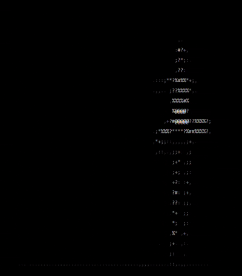

<h1 align="center"> [ GIF to ASCII Art Converter ]</h1>

<p align="center">
  <strong>A simple, colorful, and highly customizable CLI tool to convert animated GIFs into ASCII art right in your terminal, or export them to HTML and text files!</strong>
</p>

<p align="center">
  
</p>

<p align="center">
  
  
</p>

---

## [ Features ]

* **Terminal Playback:** Watch ASCII animations directly in your console.
* **Color Support:** Keep original GIF colors or apply custom terminal colors (Matrix green, cyan, etc.).
* **HTML Export:** Generate standalone animated HTML pages to share your art.
* **Frame Extraction:** Export all frames to a single text file or a directory.

## [ Installation ] 

1. **Clone the repository:**
   ```bash
   git clone [https://github.com/TON_PSEUDO/gif2ascii.git](https://github.com/TON_PSEUDO/gif2ascii.git)
   
   cd gif2ascii